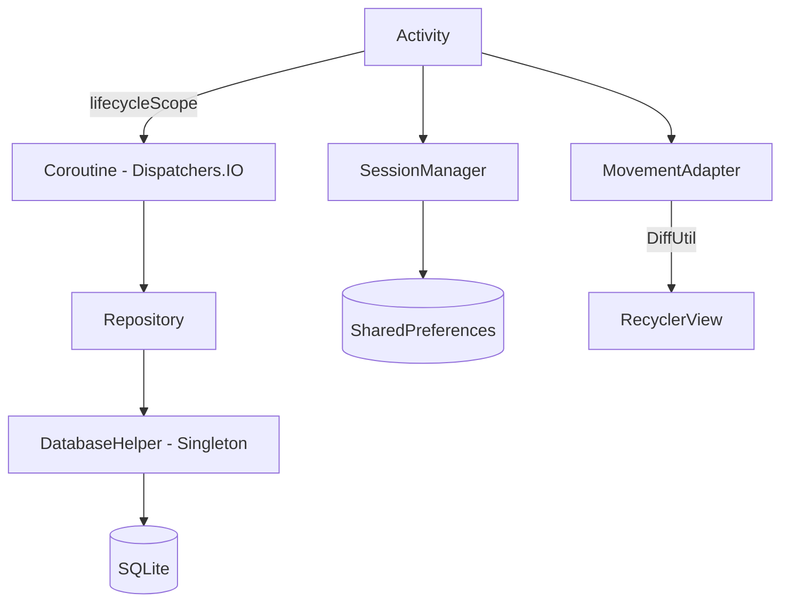
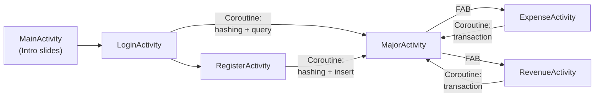
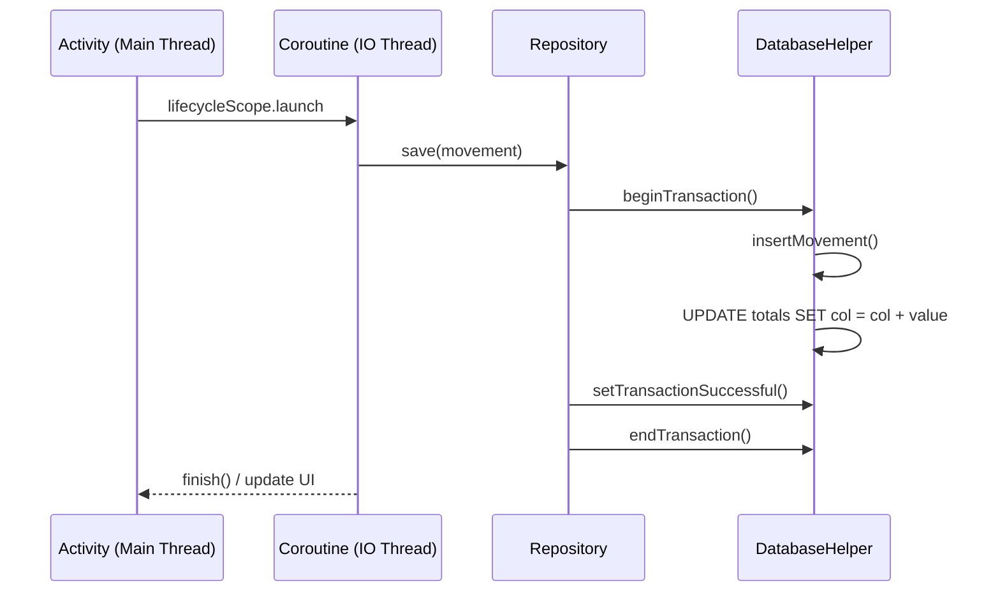
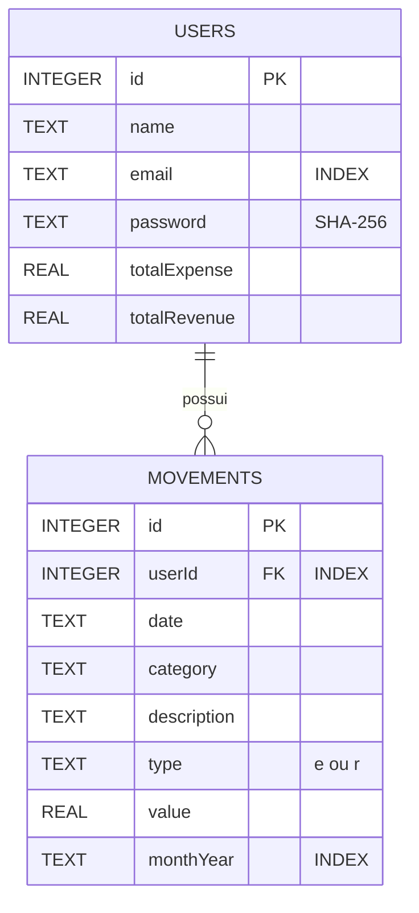

# Organizze

Aplicativo Android de controle financeiro pessoal desenvolvido em Kotlin. Permite registrar receitas e despesas, visualizar o saldo e acompanhar movimentações por data.

## Principais Tecnologias

| Tecnologia | Versão | Finalidade |
|-----------|--------|-----------|
| **Kotlin** | 1.9+ | Linguagem principal |
| **Kotlin Coroutines** | 1.7.3 | Operações assíncronas (DB, hashing) fora da Main Thread |
| **Lifecycle Runtime KTX** | 2.8.4 | `lifecycleScope` para coroutines vinculadas ao ciclo de vida |
| **SQLite** | nativo | Banco de dados local via `SQLiteOpenHelper` |
| **Material Design 3** | 1.12.0 | Componentes visuais (CardView, FAB, Toolbar) |
| **ViewBinding** | nativo | Acesso type-safe às views dos layouts |
| **SharedPreferences** | nativo | Gerenciamento de sessão do usuário |
| **MaterialCalendarView** | 2.0.0 | Seleção de mês para filtro de movimentações |
| **Material Intro** | 2.0.0 | Telas de onboarding/introdução |
| **Navigation KTX** | 2.7.7 | Navegação entre Activities |

## Padrões de Projeto (Design Patterns)

### Padrões Criacionais
- **Singleton** — `DatabaseHelper.getInstance()` com double-checked locking e `@Volatile` para acesso thread-safe ao banco de dados

### Padrões Estruturais
- **Repository** — `UserRepository` e `MovementRepository` isolam a camada de dados das Activities, centralizando queries e regras de negócio
- **ViewBinding** — Substituição do `findViewById` por bindings gerados em tempo de compilação, em Activities e no Adapter

### Padrões Comportamentais
- **Sealed Class** — `AuthResult` (Success/Error) para tipagem exaustiva de resultados de autenticação com `when`
- **Enum Class** — `MovementType` (EXPENSE/REVENUE) com `fromCode()` para converter códigos do banco
- **DiffUtil** — `MovementDiffCallback` no `MovementAdapter` para atualização eficiente do RecyclerView sem `notifyDataSetChanged()`
- **ItemTouchHelper** — Swipe-to-delete com callback para remoção de movimentações

### Padrões de Dados e Extensão
- **Data Class** — `User` e `Movement` com propriedades imutáveis (`val`) e propriedade computada (`balance`)
- **Extension Function** — `Double.toBRL()` para formatação monetária brasileira
- **Object Declaration** — `DateCustom` como singleton idiomático do Kotlin
- **Scope Functions** — `apply`, `with`, `use` para código conciso e legível

### Padrões de Performance e Concorrência
- **Coroutines + Dispatchers.IO** — Todas operações de banco e hashing executam em background thread
- **lifecycleScope** — Coroutines canceladas automaticamente quando a Activity é destruída (evita memory leaks)
- **Database Transactions** — `runInTransaction()` garante atomicidade em operações compostas (insert + update de totais)
- **Database Indexes** — Índices em `userId`, `monthYear` e `email` para queries performáticas
- **SQL Arithmetic** — `UPDATE SET column = column + ?` evita N+1 queries (leitura + escrita)

## Arquitetura



## Fluxo de navegação



## Fluxo de dados (save/delete)



## Estrutura do projeto

```
app/src/main/java/com/jaques/projetos/organizze/
├── activity/
│   ├── MainActivity.kt          # Onboarding (Material Intro)
│   ├── LoginActivity.kt         # Login com coroutine para hashing
│   ├── RegisterActivity.kt      # Cadastro com coroutine para hashing
│   ├── MajorActivity.kt         # Tela principal (saldo, calendário, lista)
│   ├── ExpenseActivity.kt       # Registro de despesa com coroutine
│   └── RevenueActivity.kt       # Registro de receita com coroutine
├── adapter/
│   └── MovementAdapter.kt       # RecyclerView Adapter com DiffUtil
├── helper/
│   ├── DatabaseHelper.kt        # Singleton SQLite com indexes e transactions
│   ├── SessionManager.kt        # Sessão via SharedPreferences
│   ├── DateCustom.kt            # Formatação de datas (thread-safe)
│   └── CurrencyExtensions.kt    # Extension Double.toBRL()
├── model/
│   ├── User.kt                  # Data class com propriedade computada balance
│   ├── Movement.kt              # Data class de movimentação
│   ├── MovementType.kt          # Enum EXPENSE / REVENUE com fromCode()
│   └── AuthResult.kt            # Sealed class Success / Error
└── repository/
    ├── UserRepository.kt        # Autenticação com AuthResult
    └── MovementRepository.kt    # CRUD com transactions e SQL arithmetic
```

## Modelo de dados



## Otimizações de Performance

| Problema | Solução | Impacto |
|----------|---------|---------|
| DB queries na Main Thread | `Dispatchers.IO` + `lifecycleScope` | Elimina ANR e travamentos |
| SHA-256 hashing na Main Thread | Coroutine em background | Login/cadastro sem freeze |
| N+1 queries (ler + escrever totais) | SQL arithmetic `SET col = col + ?` | 50% menos operações de DB |
| Falta de transações | `runInTransaction()` | Integridade dos dados garantida |
| `notifyDataSetChanged()` | `DiffUtil` no adapter | Scroll suave, sem flicker |
| Queries sem índices | Indexes em `userId`, `monthYear`, `email` | Queries O(log n) vs O(n) |
| `SimpleDateFormat` compartilhado | Nova instância por chamada | Thread-safety |
| `ContextCompat.getColor()` repetido | Cache de cores no adapter | Menos lookups de recurso |
| Botão clicável durante operação | `isEnabled = false` durante coroutine | Evita duplo clique |

## Layouts

| Tela | Arquivo |
|------|---------|
| Onboarding | `activity_main.xml`, `intro_1..4.xml`, `intro_cadastro.xml` |
| Login | `activity_login.xml` |
| Cadastro | `activity_register.xml` |
| Principal | `activity_major.xml`, `content_major.xml` |
| Despesa | `activity_expense.xml` |
| Receita | `activity_revenue.xml` |
| Item lista | `adapter_movement.xml` |

## Como executar

1. Clone o repositório
2. Abra no Android Studio (Ladybug 2024.2.2+)
3. Sincronize o Gradle
4. Execute no emulador ou dispositivo físico (API 23+)
